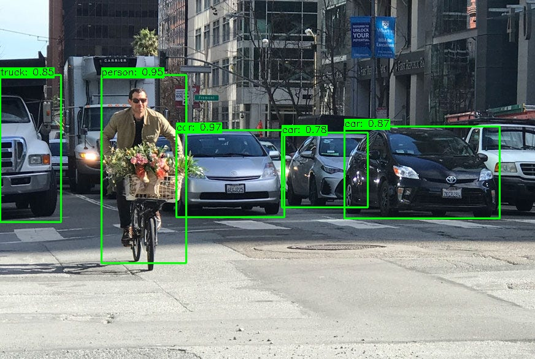

# YOLO Object Detection

This repository contains a C++ implementation of YOLO object detection using OpenCV's DNN module.





## Prerequisites

- OpenCV 4.6.0 or higher with DNN module
- CMake 3.0 or higher
- C++ compiler (GCC 13.3.0 or compatible)

Download weights from: https://get.andrejvysny.sk/yolo-weights/

## Building

1. Build 
   ```bash
   cmake -B build -S . && cmake --build build -j
   ```

2. Run
   ```bash
   ./build/image_inference ./config.yml images/image.png
   ```

This will process the image using the YOLO detector and display the detections.

If needed adjust configuration in `config.yml`. Configuration is loaded in runtime, not needed to rebuild always.


*Disclaimer: This code was generated with the assistance of AI (GitHub Copilot) and may contain errors. Please review and test thoroughly before use.*
